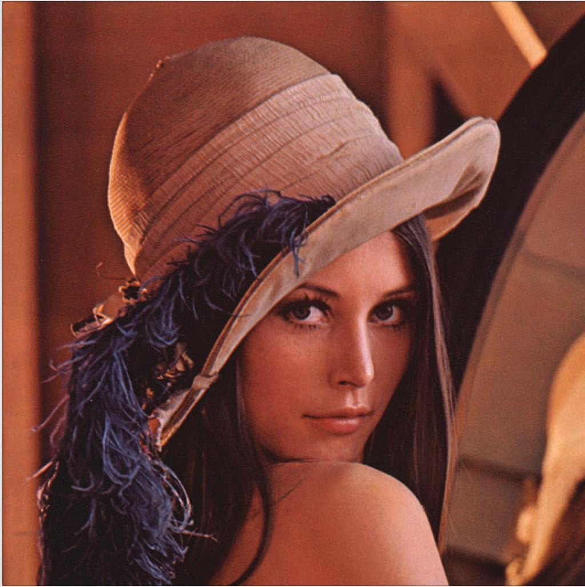
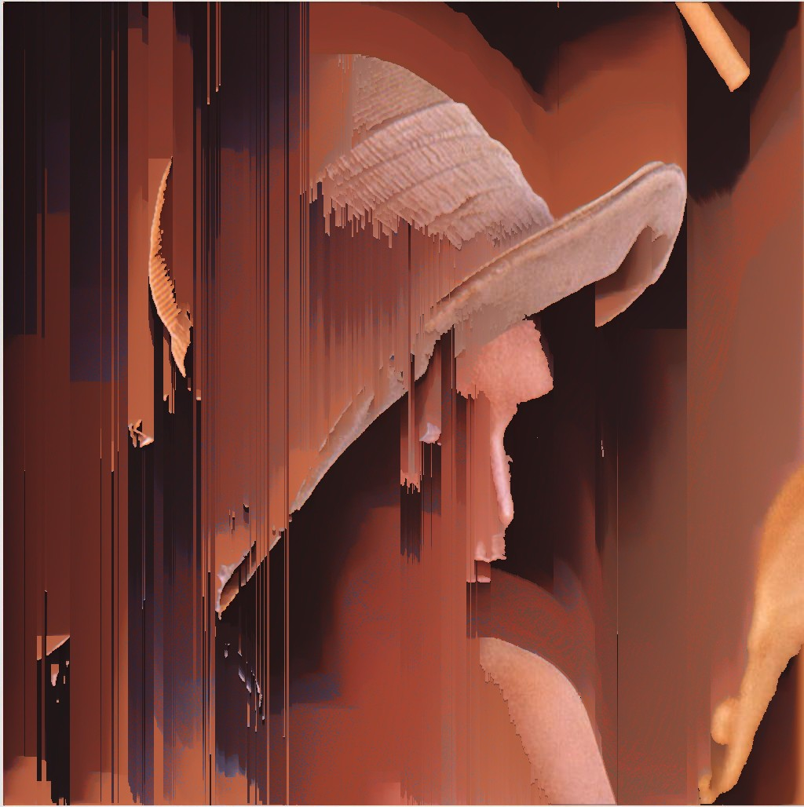

# Pixel Sorting Art

This Python script applies artistic pixel sorting to `.tiff` images based on brightness thresholds. Inspired by glitch aesthetics similar to Kim Asendorf's work.

## Features

- Brightness-based pixel sorting (modes: bright or dark)
- Works with `.tiff` images for processing
- Uses Pillow, NumPy, and tifffile
- Includes horizontal and vertical pixel sorting
- Ready to run and easy to customize

---

## Example Results

### Mountains (before and after)

**Input**  


**Output**  


---

### Lady (before and after)

**Input**  


**Output**  


---

## How to Use

1. Place your `.tiff` images inside the `Aphelion/` folder.
2. Open `pixel_sort.py` and configure:
   - `input_path`
   - `output_path`
   - `mode`: `"bright"` or `"dark"`
   - `threshold`: brightness threshold (0–255)
3. Run the script:

```bash
pip install -r requirements.txt
python pixel_sort.py
